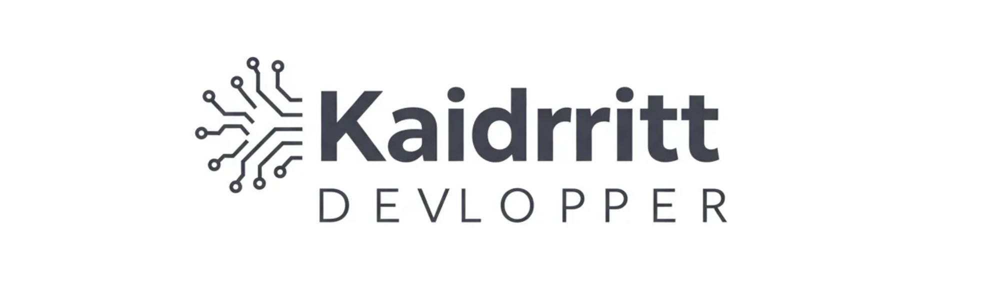

<h1>
    <a href="https://github.com/kaidritt">
    Kaidritt
</h1>

Software Development Intern, eager to learn and passionate about technology. Currently exploring the world of web development and loving every minute of it! My journey started with a fascination for how things work behind the scenes, leading me to code.
 
A tech enthusiast with a particular interest in AI, cloud computing, and open-source projects. Always open to new challenges and opportunities to expand my skillset.

### Connect with me

### GitHub Stats

